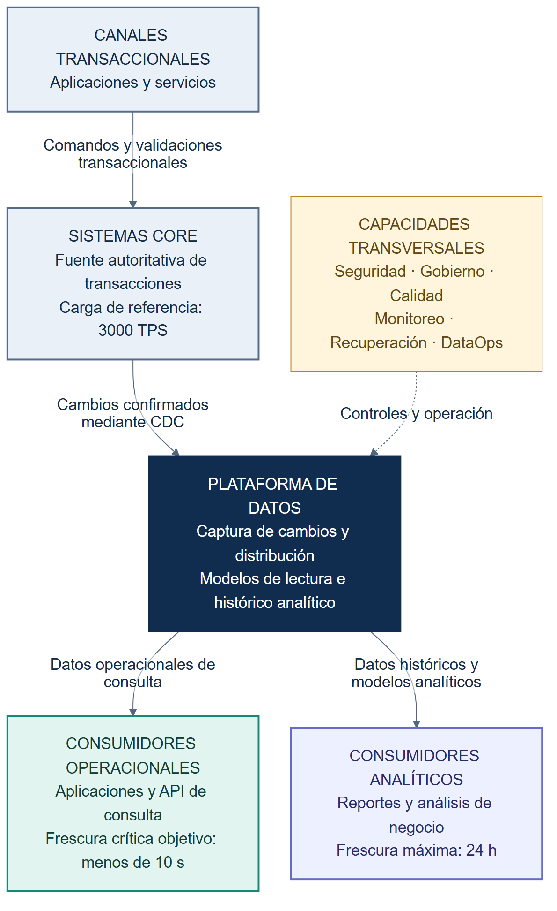
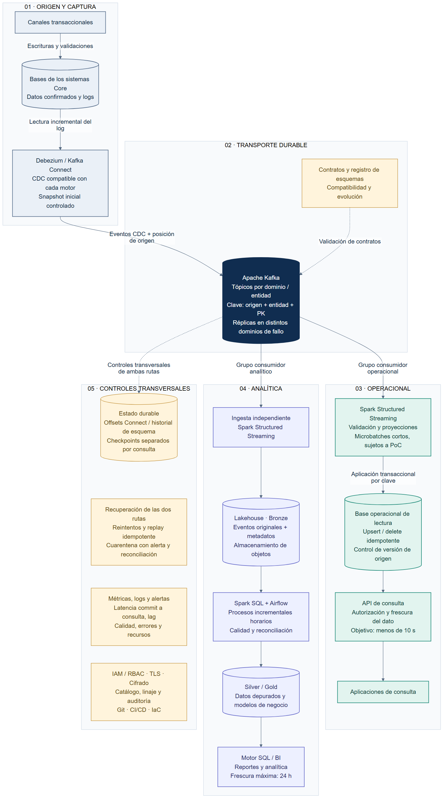

# Arquitectura de datos: desacoplamiento del Core

**Jorge Prieto · Diseño de referencia · Septiembre de 2026**

Propuesta de arquitectura para trasladar las consultas operacionales y analíticas fuera de los sistemas transaccionales. Combina captura de cambios (CDC), distribución de eventos y modelos de lectura independientes. Este repositorio contiene el diseño; las capacidades y tiempos indicados son objetivos por validar, no resultados de una implementación desplegada.

## Diseños de arquitectura

### Nivel 0 — Contexto

Vista de los sistemas participantes, sus consumidores y los principales flujos de información.



[Ver SVG ampliable](diagrams/nivel-0.svg) · [Fuente editable Mermaid](diagrams/nivel-0.mmd)

Las aplicaciones mantienen sus escrituras y validaciones transaccionales en el Core. Las consultas que toleran la frescura acordada se trasladan a la plataforma de datos. Las operaciones que requieren consistencia inmediata siguen consultando el sistema autoritativo de forma controlada.

### Nivel 1 — Componentes y flujos

Descomposición de la plataforma: captura, transporte durable, consulta operacional, analítica y operación transversal. La numeración 0/1 corresponde a los niveles solicitados; se usa una notación de contexto y componentes inspirada en C4, sin equipararla a su numeración oficial.



[Ver SVG ampliable](diagrams/nivel-1.svg) · [Fuente editable Mermaid](diagrams/nivel-1.mmd)

## Requisitos y respuesta del diseño

| Requisito | Decisión | Validación de aceptación |
|---|---|---|
| Aliviar la carga del Core | CDC basado en logs y traslado de consultas a una base operacional y al lakehouse | Comparar CPU, I/O, latencia transaccional y consultas antes y después; medir también el costo de CDC |
| Datos críticos disponibles en menos de 10 segundos | Ruta operacional independiente, microbatches cortos y proyecciones indexadas | Medir desde el commit de origen hasta que el cambio es consultable; registrar p95, p99, máximo y cada incumplimiento |
| Analítica con espera máxima de 24 horas | Ingesta continua y transformaciones incrementales horarias | Medir la antigüedad de los datos publicados por entidad y alertar antes de agotar el plazo |
| Recuperación automática | Offsets y checkpoints durables, reintentos y aplicación idempotente | Interrumpir conectores, consumidores y destinos; verificar reanudación sin pérdida ni efectos duplicados |
| Monitorear sincronización y procesamiento | Métricas de CDC, lag, frescura, calidad, procesamiento y recursos | Alertas por retraso, fallos de tareas, discrepancias y saturación |
| 3000 TPS en origen | Dimensionamiento por eventos y bytes, particiones y pruebas de capacidad | Carga sostenida de referencia y picos definidos con negocio; incluir recuperación del backlog |

Una interrupción puede romper el objetivo de 10 segundos. Se debe detectar, mostrar la antigüedad del dato y aplicar el procedimiento acordado para consultas críticas. No se hace un retorno masivo automático de consultas al Core porque podría agravar su saturación. RTO, RPO y disponibilidad requieren acuerdo explícito.

## Metodologías, frameworks y principios

- **TOGAF, aplicado de forma proporcional:** analizar situación actual y objetivo, requisitos, alternativas, brechas y transición; registrar decisiones mediante ADR.
- **DAMA-DMBOK:** definir propietarios y responsables de datos, catálogo, clasificación, calidad, linaje y retención.
- **Vistas de contexto y componentes inspiradas en C4:** comunicar límites, responsabilidades, dependencias y recorridos de información.
- **Arquitectura orientada a eventos y CQRS:** separar las escrituras autoritativas de las proyecciones de consulta. CDC captura cambios confirmados sin exigir escrituras dobles en las aplicaciones.
- **DataOps:** versionar contratos y pipelines, validar cambios mediante CI/CD, provisionar con IaC y promover por ambientes con controles y rollback.
- **Principios:** desacoplamiento, escalabilidad horizontal, tolerancia a fallos, consistencia eventual explícita, idempotencia, observabilidad, mínimo privilegio y protección de datos desde el diseño.

## Decisiones técnicas

1. **Captura:** Debezium sobre Kafka Connect, cuando el motor y su configuración sean compatibles. Ejecutar un snapshot inicial consistente y controlado, seguido de CDC. Validar permisos, licencias, retención de logs y carga antes de activar la captura. [Arquitectura de Debezium](https://debezium.io/documentation/reference/architecture.html).
2. **Transporte:** Kafka distribuye eventos a grupos consumidores independientes. Ordenar por clave compuesta de origen, entidad y clave primaria. Usar replicación entre dominios de fallo; una configuración inicial a evaluar es factor de replicación 3, `min.insync.replicas=2` y productores con `acks=all`. Esto no sustituye un plan de recuperación regional.
3. **Consulta operacional:** Spark Structured Streaming valida y transforma cambios; una base relacional de lectura, por ejemplo PostgreSQL en alta disponibilidad, expone proyecciones mediante API. La elección final depende del volumen, patrón de consultas y prueba de concepto. El trigger corto no garantiza por sí mismo la latencia extremo a extremo.
4. **Analítica:** otro consumidor conserva los eventos originales en Bronze. Spark SQL transforma a Silver/Gold, con Airflow para dependencias, reintentos, reconciliación y publicación. Las cargas analíticas no compiten con las operacionales por el mismo grupo consumidor ni por sus recursos de cómputo.
5. **Seguridad y gobierno:** TLS, cifrado en reposo, credenciales en un gestor de secretos, cuentas técnicas con privilegios mínimos, segregación de redes, auditoría y enmascaramiento según clasificación. Los contratos versionan claves, tipos, semántica y tratamiento de borrados.

## Recuperación y consistencia

- Conservar offsets de Connect e historial de esquemas en almacenamiento durable; reiniciar consumidores desde su progreso registrado. Cada consulta streaming usa su propio checkpoint persistente. [Estado de Debezium](https://debezium.io/documentation/reference/3.4/configuration/storage.html).
- Tratar la entrega como **al menos una vez**. En la base operacional, comparar la posición/versión de origen y aplicar el cambio y el registro de progreso de forma atómica. Los reintentos no deben sobrescribir una versión nueva con una antigua. Conservar también la versión de los borrados para evitar resurrecciones durante un replay.
- Para `foreachBatch`, diseñar explícitamente la escritura idempotente; un checkpoint no vuelve transaccional un destino externo. [Guía de Structured Streaming](https://spark.apache.org/docs/3.5.6/structured-streaming-programming-guide.html).
- Reintentar fallos transitorios con espera progresiva. Los eventos inválidos se preservan en cuarentena, generan una alerta y se reprocesan manteniendo su identidad y versión original. Una entidad crítica con eventos pendientes queda marcada como no actualizada; no se ocultan pérdidas mediante descartes.
- Dimensionar la retención de Kafka y los logs del origen para la interrupción máxima prevista más el tiempo de recuperación. Si el log requerido ya no existe, realizar resincronización consistente y reconciliación antes de habilitar nuevamente la proyección afectada.
- No asumir orden global entre fuentes ni atomicidad entre múltiples proyecciones. Si una consulta exige consistencia de una transacción que modifica varias entidades, debe definirse una proyección transaccional o una ruta autoritativa específica.

## Capacidad, observabilidad y pruebas

Los 3000 TPS no equivalen necesariamente a 3000 eventos por segundo. El cálculo inicial es:

```text
eventos/s = transacciones/s × promedio de cambios capturados por transacción
bytes/s   = eventos/s × tamaño medio del evento serializado
retención = bytes/s × segundos retenidos × factor de replicación
```

Por ejemplo, con 2 cambios por transacción y eventos de 1 KB decimal: 6000 eventos/s, aproximadamente 6 MB/s y 518,4 GB/día de datos sin comprimir. Con tres réplicas serían aproximadamente 1,56 TB/día antes de compresión, índices, metadatos y margen operativo. Son supuestos ilustrativos, no mediciones ni un dimensionamiento definitivo.

Medir skew de claves, capacidad del destino, tiempos de microbatch, bytes de red y disco, backlog y velocidad de recuperación. Ajustar particiones y recursos mediante pruebas, sin equiparar automáticamente TPS con particiones. Para drenar una acumulación, la capacidad de procesamiento debe superar la tasa de llegada sostenida.

Las pruebas cubren inserciones, actualizaciones, borrados, duplicados, eventos fuera de orden, cambios de esquema, caída de un nodo, indisponibilidad de destinos, pérdida de continuidad del log, reconciliación y carga sostenida. La frescura se mide por entidad usando posiciones de origen, timestamps confiables y eventos de control cuando sea necesario.

## Implementación progresiva

1. Descubrimiento de entidades, consultas, contratos, clasificación y SLA; línea base de carga.
2. PoC de CDC y extremo a extremo con una entidad crítica; validación de latencia e impacto.
3. Construcción de ambas rutas, recuperación, controles y monitoreo.
4. Operación en paralelo, comparación contra origen y pruebas de carga y fallos.
5. Migración gradual de consultas con criterios de aceptación y rollback controlado.

Roles: arquitectura, ingeniería de datos, DBA, DevOps/SRE, QA, seguridad y responsables de negocio/datos. Estimar el costo con dedicación por rol, cómputo, almacenamiento, retención, red, licencias y soporte después de medir la PoC.
